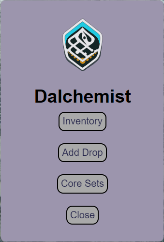
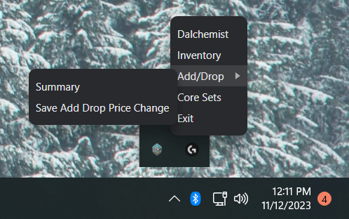
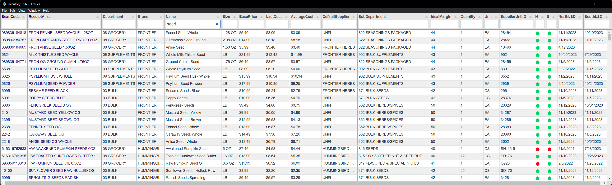
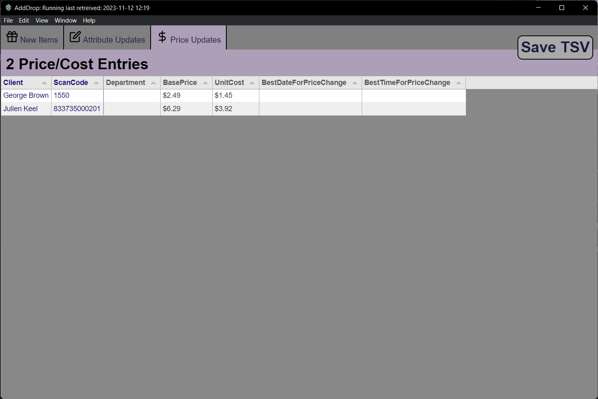
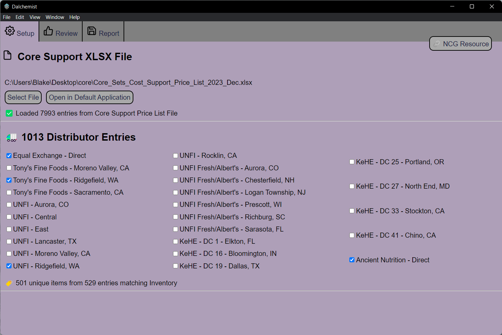

# Dalchemist

Version 0.0.2

Dalchemist continues running in the background after launched until "Exit" is chosen from either the taskbar or a window menu. Even after all windows are closed. The main window and taskbar menu provides access to 3 modules: Inventory, Add-Drop, and Core Support.

## Main Window

The main window is shown on launch and can be accessed through the taskbar menu after closed. The main window starts by showing a loading status. Once the Inventory and Add Drop Data has been retrieved, the **main window** shows the buttons for showing each module.

## Taskbar Menu

Accessed through the system tray, some menus will be disabled until the data has been retrieved. **Dalchemist** opens the main window and **Exit** stops the App. The other options are shortcuts to functions available through the window interfaces.

## Inventory

The Inventory values are pulled from a Google sheet and should match our Catapult inventory; half an hour after last replication.

Inventory items can be filtered and sorted by any value in the table. The string filter is case insensitive and will match values containing the input anywhere in their value.

## Add Drop

The Add Drop interface is updated with values from the Google sheet every 100 seconds. The interface has three tables; _New Items_, _Attribute Changes_, and _Price Updates_ that allow you to review the current add/drop items.

If any New Item entries match our inventory then they will show up on an Invalid Items tab where the values can be compared.

The Price Change tab has a button "Save TSV" that provides a prompt to sale the Price/Cost changes as a tab seperated file that can be imported directly into catapult. There is also a taskbar menu option to do this without opening the window.

## Core Support

The Core Support Module

